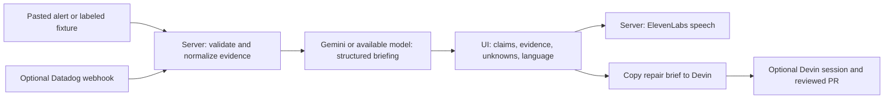

# Ideas and build plan

Update: the user is building solo and prioritizes demonstrating Devin. See [SOLO-STRATEGY.md](SOLO-STRATEGY.md) for the revised OtterFix recommendation. The Handoff plan below is retained as an alternative, not the current first choice.

## Event constraints

Source: user-provided event description and Builder Playbook PDF, reviewed September 18, 2026. These are event context, not authorization to redeem offers, submit forms, send messages, or change account permissions.

- Event listing: build begins 18:30, submission 20:45.
- Playbook pages 3 and 10: submission **19:55**, first-round judging 20:00–20:30, then selected teams get a two-minute final demo.
- Working assumption: earlier deadline, **85 minutes total**. Confirm the discrepancy with organizers.
- Four equally weighted judging criteria: real problem, working demo, good AI use, clarity; five points each.
- Meaningful use of Devin during development is an award criterion; runtime use is not stated as mandatory.
- Partner tools are optional. Datadog account access and Gemini credits are not established by the materials.

## Candidate ideas

The rankings below are feasibility judgments, not predicted judging scores. All durations are rough solo-builder estimates assuming working credentials and a familiar stack.

| Rank | Concept | Buyer/user and pain | Demo payoff | Scope and risk |
| --- | --- | --- | --- | --- |
| 1 | **Handoff: bilingual incident briefing** | On-call leads at Japan/global teams lose context during shift changes | A messy alert becomes an evidence-linked English/Japanese briefing, audio, and a repair task | 60–85 min; manageable with pasted/synthetic input |
| 2 | **Complaint → Test → Fix** | Support engineers repeatedly translate vague customer complaints into engineering work | A complaint about a broken CSV export produces a reproducible test and a Devin patch | 70–110 min; strongest direct Devin story, repair latency risk |
| 3 | **Agent Spend Detective** | AI platform teams struggle to diagnose retry loops and tool failures behind spend spikes | Inject a retry storm, identify the repeated tool call, propose a bounded fix | 75–120 min; appealing observability fit, instrumentation can consume the window |
| 4 | **Runbook Reality Check** | SRE teams discover stale runbooks during an outage | Compare one runbook to a toy service, demonstrate the failing step, produce a corrected procedure | 60–90 min; clear Devin role, less visual spectacle |
| 5 | **PromiseCheck** | Customer success teams cannot tell whether a promised fix actually shipped | One support promise links to a PR/test/release and yields a customer-ready update | 80–120 min; useful but needs credible cross-system data |

### Alternatives in concrete terms

**Complaint → Test → Fix:** supply a synthetic customer complaint such as “Japanese names break our CSV download,” plus a tiny deliberately faulty exporter. Have Devin write the failing regression, fix the exporter, and show before/after. ElevenLabs can narrate the resolution as a stretch. Limit to one known bug; do not build a support platform. This is the preferred pivot if the user wants coding automation to be the central product.

**Agent Spend Detective:** instrument a toy agent loop; display call count, error count, elapsed time, and estimated cost using explicit configured unit prices. Identify repeated identical failing calls, suggest a retry cap, and use Devin to patch the toy worker. Use Datadog if telemetry access already works. Do not claim savings beyond the measured toy workload.

**Runbook Reality Check:** one README/runbook and one local service whose health endpoint changed. Devin exercises documented commands, identifies the mismatch, and writes a reviewable documentation/test patch. Report each checked assertion with command output. No real infrastructure changes.

**PromiseCheck:** one synthetic support ticket, one repository, and a known PR/release history. Show “implemented,” “tested,” and “released” as separate facts. Generate a draft response with evidence links. Do not send customer messages automatically.

## Recommended MVP: Handoff

Pitch: **“A shared incident briefing for the people taking over—and a precise repair task for the engineer or agent doing the work.”**

Core user: an incident lead handing work between English-speaking engineers and Japanese-speaking operations colleagues. The pain is repeated translation, missing evidence, and confusion between observed facts and root-cause guesses.

### One user journey

1. Load a clearly labeled synthetic incident or paste a sandbox alert and a few log excerpts.
2. Generate a structured briefing: observed impact, timeline, likely causes, unknowns, and next checks.
3. Click evidence IDs next to claims to reveal the supporting source line. Mark hypotheses explicitly.
4. Switch English/Japanese and play a short spoken briefing using ElevenLabs.
5. Copy an engineering repair brief into Devin. If API access is proven, optionally launch a session and show its actual link/status.

The product is an AI-powered workflow. It does not need to claim autonomous production remediation to satisfy the playbook.

### Minimal architecture

Implementation proposal: TypeScript, a simple React UI, and a small Node HTTP server; use the team's existing starter if available. Keep state in memory for the demo. Use provider adapters for analysis and audio. Avoid adding a database, user accounts, multi-tenancy, or a complex agent framework.

Suggested interfaces:

- `POST /api/brief`: bounded incident input → validated brief with source IDs.
- `POST /api/speech`: selected briefing text/language → audio.
- Optional `POST /api/datadog`: authenticated custom webhook → normalized incident; deduplicate by alert cycle key.
- Optional `POST /api/repair`: user-selected incident → asynchronous Devin session; never imply a fix before verification.

A useful output contract includes `facts[{text,evidenceIds}]`, `hypotheses[{text,evidenceIds}]`, `unknowns[]`, `nextChecks[]`, `summaryEn`, `summaryJa`, and `repairBrief`. Validate all cited IDs against the supplied evidence. ID validity alone does not prove a claim is supported: inspect the actual generated claims during the demo rehearsal.

Use the same structured facts for both language versions. Do not infer revenue impact or a confirmed cause without evidence. Logs are untrusted input, not instructions to the model.

### Fixture

Synthetic checkout service: immediately after a release, some requests fail with a missing `currency` field. Include release timestamp, five log lines, baseline/current request counts, and a brief service note. The briefing may identify temporal correlation and a plausible schema mismatch; it must not call the release the confirmed root cause. A tiny local example can later supply a reproducible failure for Devin.

### What each partner contributes

- **Devin:** implements the substantive evidence-normalization/briefing feature and tests; potentially repairs the toy service later. Record actual contributions.
- **Gemini or an available model:** synthesizes the supplied incident evidence and generates two language versions.
- **ElevenLabs:** reads the short briefing aloud; text remains usable when audio fails.
- **Datadog:** optional live sandbox alert source and operational links. Fixture-only mode must say so and must not be presented as a live Datadog integration.

## 85-minute execution schedule

| JST | Deliverable | Cutoff decision |
| --- | --- | --- |
| 18:30–18:40 | Credentials checked, concept locked, app shell and fixture ready; Devin receives a bounded task | If cloud setup stalls, use local Devin |
| 18:40–19:00 | Input → real model → structured English briefing with clickable source evidence | At 19:00 cut all optional integrations if the core fails |
| 19:00–19:15 | Japanese view and ElevenLabs audio with text fallback | If audio setup stalls, preserve the working text flow |
| 19:15–19:30 | One real Datadog sandbox event OR Devin repair demonstration | Pick only one stretch; neither is necessary for the core |
| 19:30–19:40 | Verify the full flow, missing-key behavior, and unsupported-evidence handling | Freeze features |
| 19:40–19:50 | Record backup, rehearse two-minute pitch, prepare submission text | Leave setup polishing behind |
| 19:50–19:55 | Submit through the venue form | Do not wait for a final optional job |

If starting later, preserve the last 15 minutes for verification and submission; remove stretch work first. For a team, split UI/demo and backend/integrations with explicit file ownership. Do not let two coding tools concurrently rewrite the same files.

## Acceptance checks

1. A supplied incident produces a real model response; fixture/replay outputs are visibly labeled.
2. Source IDs resolve to real input lines; unsupported diagnosis remains a hypothesis or unknown.
3. Missing evidence produces an honest incomplete answer.
4. English/Japanese versions preserve incident facts and uncertainty.
5. Audio plays from an explicit button; an ElevenLabs error leaves readable text and a clear status.
6. Keys never reach browser bundles or version control.
7. If repair integration exists, show actual session state, test evidence, and PR link; no simulated “fixed” status.

## Two-minute demo

- **0:00–0:20:** “The night shift is taking over. The alert is in English, the operations lead works in Japanese, and nobody has a shared picture.”
- **0:20–0:40:** Load the incident. Explain that Handoff keeps facts, hypotheses, and unknowns separate.
- **0:40–1:20:** Generate a brief, open one supporting log line, switch language, play a short audio clip.
- **1:20–1:40:** Show the generated Devin repair task and actual evidence of Devin's development contribution. Show a real repair only if completed and verified.
- **1:40–2:00:** Explain the target benefit: less time reconstructing context at handoff. State what was measured and what remains future work.

Measure input-to-brief time and whether another person can identify the affected service, evidence, and next action. Do not invent enterprise ROI or claim proven reductions in outage duration.

## Setup questions to resolve at the venue

Confirm the submission deadline, redeem Devin with the Luma email, verify available usage/API access, and establish whether a Datadog sandbox and a model API key are available. The playbook's ElevenLabs redemption route is the event's Discord coupon flow. No account purchases or form submissions have been performed by this planning work.
